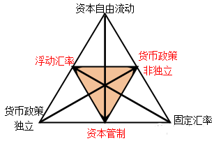
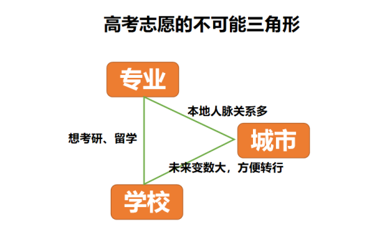

-----

| Title     | 决策 方法 不可能的三角形                                   |
| --------- | ----------------------------------------------- |
| Created @ | `2023-05-28T15:01:19Z`                          |
| Updated @ | `2023-05-28T15:32:30Z`                          |
| Labels    | \`\`                                            |
| Edit @    | [here](https://github.com/junxnone/s/issues/19) |

-----

# “不可能的三角形" 决策法

  - 又称为 ”蒙代尔三角形”“三元悖论”
  - 选择 三个目标(优化方向)
      - 两个目标容易使目标极端化，不能达到平衡的效果
      - 更多目标容易平庸，更难做出决策，或者做出错误决策
  - 三个目标中必须放弃一个
      - 稀缺性: 有限的投入
      - 比较优势: 更有优势的方向
      - Top 1 目标 --\> 优势资源(投入) --\> 减法(聚焦)
  - 枚举不同的决策达到不同的目标(输入不同samples,获取不同的优化结果)

## 步骤

  - 资源约束目标精简为三项
  - 放弃一项
  - 剩下两项中选一项指定"底线"
  - 最后一项作为 Top 1 评价

### 如何放弃

  - 和事情的起因或者潜在目的关系比较紧密
  - 例如: `如果你因为“现职位不能让自己发挥能力”而跳槽，那就可以放弃“目标公司的行业地位”这项评估标准`

### 控制线指标

  - 不是决定性因素，第二重要因素
  - `比如把“薪资涨幅”作为控制性指标，定为“不少30%`

## 例子

|  |  |
| ------------------------------------------------------------ | ------------------------------------------------------------ |
