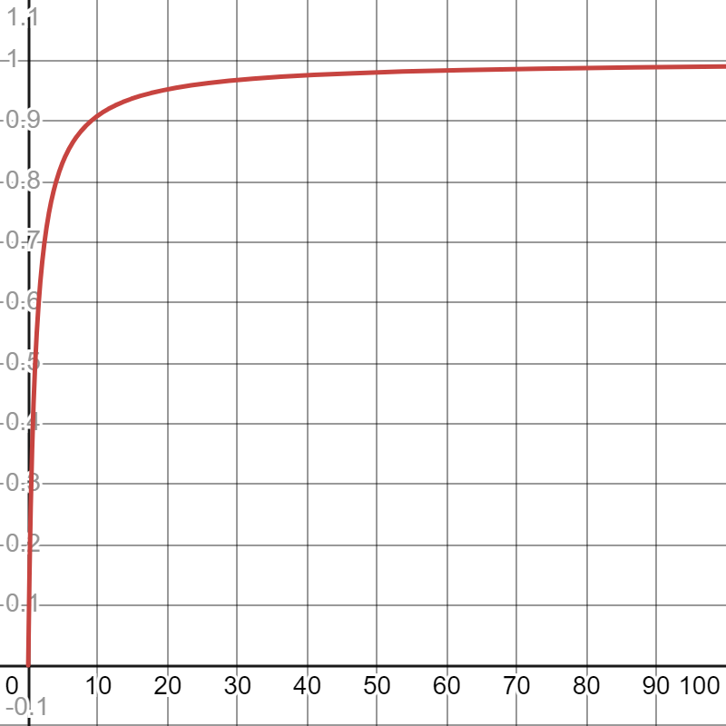

-----

| Title     | x 人                                             |
| --------- | ----------------------------------------------- |
| Created @ | `2024-07-26T02:08:54Z`                          |
| Updated @ | `2024-07-26T02:18:37Z`                          |
| Labels    | \`\`                                            |
| Edit @    | [here](https://github.com/junxnone/s/issues/25) |

-----

# 人

  - 人是由什么组成的？骨骼+血肉+思想？
  - 那么思想占多少？肯定是个大头，而且是可变的，从出生开始逐渐占的比例越来越大，然后止于或者趋于某个点(像是某种函数)。
  - 思想是飘渺的，现实才是看得见，摸得着的。当思想映射到行动，思想才能进一步得到升华。
  - 结果是一种状态，是现在也是过去，也是思想的沉淀与积累。

| 理想状态下思想随着时间的变化在人的组成中的占比                                                 |
| ----------------------------------------------------------------------- |
|  |

## 思想

  - 理想状态下是这样的，当然一部分人在某个地方开始拖延症，就只能乘以一个 \[0,1) 之间的系数了
  - 而且思想的价值(权重)也是各不相同的，而且也应该不是绝对的，对己对他人也是不同的价值
